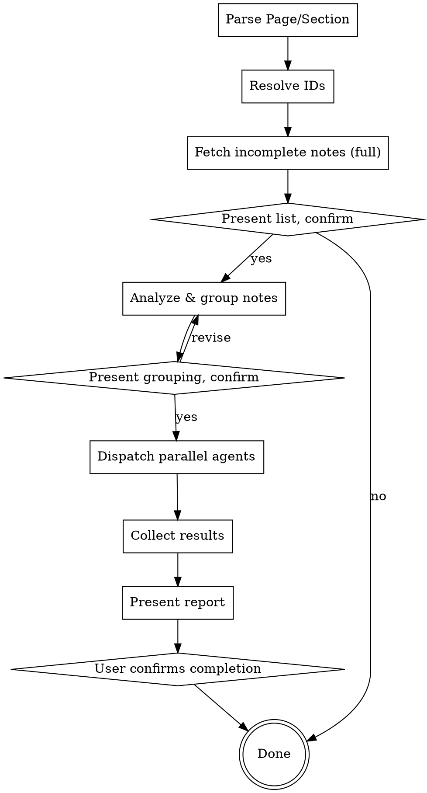

# Execute Notes

Batch-execute incomplete Slate notes by dispatching parallel agents grouped by work area.

## Trigger

User says something like:
- "execute notes in OPS/iOS"
- "execute all notes in My Project/Settings"
- "run through the notes in OPS/Calendar"

Format is always `Page/Section` or just `Page` (for all sections).

## Workflow



## Step 1: Resolve Page & Section

1. Call `slate_list_pages` to find the page by name (case-insensitive match)
2. If a section is specified, call `slate_list_sections` with the page_id to find the section by name
3. If page or section not found, tell the user and list available options
4. Store the resolved `page_id` and optionally `section_id`

## Step 2: Fetch All Incomplete Notes

1. Call `slate_list_notes` with:
   - `page_id` (always)
   - `section_id` (if specified)
   - `completed: false`
   - `full: true` (need complete note content to understand each task)
2. If zero notes, tell user "No incomplete notes found" and stop

## Step 3: Confirm Scope

Present to the user:
```
Found [N] incomplete notes in [Page] / [Section].

[Numbered list of all notes with full content]

Execute all [N] notes? (y/n)
```

Wait for user confirmation before proceeding. The user may say "yes", or may say "skip #4 and #7" or "only do #1-#10". Respect any scoping.

## Step 4: Analyze & Group Notes

Read all note contents and group them into 2-5 independent workstreams. Grouping criteria (use best judgment):

- **By app area / feature** (preferred) — e.g., "Job Board", "Calendar", "Settings"
- **By component / file proximity** — notes that likely touch the same files go together
- **By type** — bugs in one group, features in another, UI polish in another

### Grouping Rules

- **Independence is critical.** Two notes that touch the same component/file MUST be in the same group. Agents editing the same files will conflict.
- **Target 2-5 groups.** Fewer than 2 = no parallelism. More than 5 = coordination overhead.
- **Misc bucket is fine.** Small unrelated fixes can go in one "Quick Fixes" group.
- **Single-note groups are OK** if that note is complex enough to warrant its own agent.

### Complexity Assessment

For each group, assess complexity:
- **Simple** — copy changes, small CSS/style tweaks, config changes, obvious one-line fixes
- **Complex** — multi-file logic changes, new features, architectural work, bug investigation

## Step 5: Confirm Grouping

Present the proposed grouping:
```
I'll split these [N] notes into [M] workstreams:

1. [Group Name] ([count] notes, [simple/complex]) — #1, #3, #7...
   Summary: [one-line description of what this group covers]

2. [Group Name] ([count] notes, [simple/complex]) — #2, #5, #9...
   Summary: [one-line description]

...

Proceed with this grouping? (y/n, or suggest changes)
```

Wait for confirmation. User may rearrange groups.

## Step 6: Dispatch Agents

For each group, dispatch an agent using the Agent tool with a prompt structured as follows:

### Agent Prompt Template

```
You are executing Slate notes for [Page] / [Section].
Your workstream: [Group Name]

## Notes to execute

[For each note in this group:]
- Note #[num] (id: [note_id]): [full content]
  Tags: [tags]

## Instructions

1. Before starting each note, call slate_update_note to tag it IN-PROGRESS:
   slate_update_note(id: "[note_id]", tags: ["IN-PROGRESS"])

2. Read the relevant code, understand the context, and make the changes.

3. After completing each note:
   - If the fix is simple and obviously correct (typo, config, small CSS):
     → Call slate_update_note(id: "[note_id]", completed: true)
   - If the change needs user review or testing:
     → Call slate_update_note(id: "[note_id]", tags: ["NEEDS-TESTING"])
     → Do NOT mark completed
   - If you cannot complete the note (missing info, blocked by something):
     → Call slate_update_note(id: "[note_id]", tags: ["BLOCKED"])
     → Update the note content to explain why

4. Work through ALL notes in your list. Do not skip any.

5. When done, return a summary in this exact format:

COMPLETED: [list of note #s and one-line description of what was done]
NEEDS-TESTING: [list of note #s and what to test]
BLOCKED: [list of note #s and why]
```

### Model Guidance

- **Complex groups** → dispatch with default model (Opus-class for deep reasoning)
- **Simple groups** → note in the dispatch that these are simple fixes (when Claude Code supports per-agent model selection, these would use Sonnet/Haiku)

Currently all agents inherit the session model. This guidance is for future compatibility and for the main agent's awareness of cost.

## Step 7: Collect & Report

After all agents return, consolidate results:

```
## Execution Report: [Page] / [Section]

### Summary
- ✓ [X] notes completed
- ? [Y] notes need testing
- ✗ [Z] notes blocked
- Total: [N] notes processed

### Completed
- #3: Fixed job board filter query — simple SQL fix
- #7: Updated calendar header spacing — CSS change
...

### Needs Testing
- #1: New push notification flow — test that notifications arrive on device
- #5: Calendar sync with Google — test add/edit/delete round-trips
...

### Blocked
- #12: Missing API endpoint spec — need backend team input
- #22: Depends on backend deploy — blocked until v2.3 ships
...

Mark [X] completed notes as done? (They are already marked in Slate.)
The [Y] NEEDS-TESTING notes remain open for your review.
```

## Step 8: User Confirmation

- If user says **yes** → completed notes stay marked done. Done.
- If user says **no** or **revert** → call `slate_update_note` to set `completed: false` on all notes that were marked complete, restoring them to incomplete.
- If user says **partial** (e.g., "revert #3 and #7") → revert only those specific notes.

## Error Handling

- **Agent fails or times out** → Report which group failed, notes remain IN-PROGRESS. User can re-run that group.
- **Conflict detected** (two agents edited same file) → Flag to user, do not auto-resolve. Present both changes.
- **No codebase context** → If the skill is triggered outside a code project directory, warn the user that agents need a codebase to work in.

## Important Rules

1. **Always confirm twice** — once after fetching notes, once after proposing groups. Never auto-dispatch.
2. **Agents must update Slate** — every agent tags IN-PROGRESS before working, updates status when done.
3. **Never mark complex work as complete** — if there's any doubt, use NEEDS-TESTING.
4. **Respect independence** — if grouping can't avoid file conflicts, make those notes sequential within one group instead of parallel across groups.
